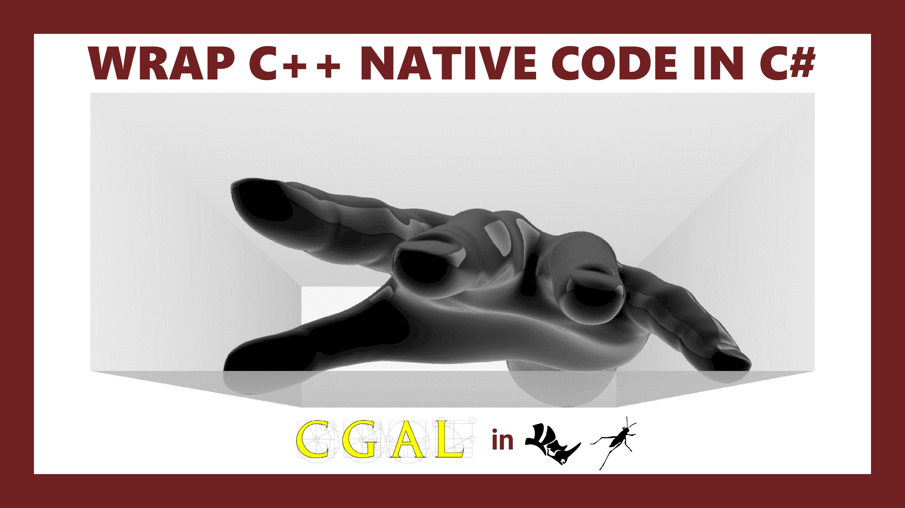

# Wrap C++ Native Code in C# with Example of CGAL Oriented Bounding Box in Grasshopper

This tutorial will show you how to wrap C++ code in C# and we will wrap the Oriented Bounding Box function in CGAL to the Grasshopper plugin from scratch.

# 📹Video

https://youtu.be/1-QXBM0VjbY

#  🌹Citation

1. [Wrapping Native Libraries](https://developer.rhino3d.com/guides/rhinocommon/wrapping-native-libraries/) by Dan Rigdon-Bel
2. [Using methodgen](https://developer.rhino3d.com/guides/rhinocommon/using-methodgen/) by Giulio Piacentino
3. [Cockroach](https://github.com/9and3/Cockroach) by Petras Vestartas and Andrea Settimi  

# ✅Prerequisites 

🔗[Visual Studio IDE](https://visualstudio.microsoft.com/)

🔗[Git](https://git-scm.com/)

🔗[vcpkg](https://vcpkg.io/en/index.html)

🔗[CGAL](https://doc.cgal.org/latest/Manual/installation.html)

🔗[Rhino VS IDE Extension](https://github.com/mcneel/RhinoVisualStudioExtensions/releases)

# 🔭Overview

🔗[PInvoke](https://docs.microsoft.com/en-us/dotnet/standard/native-interop/pinvoke)

🔗[Marshal](https://docs.microsoft.com/en-us/dotnet/api/system.runtime.interopservices.marshal?view=net-6.0)

# 🧱Fundamental

🔗[Mashaling Data Types](https://docs.microsoft.com/en-us/dotnet/framework/interop/marshalling-data-with-platform-invoke)

🔗[Calling Native Functions](https://docs.microsoft.com/en-us/cpp/dotnet/calling-native-functions-from-managed-code?view=msvc-170 )

# 👜Resource

🔗[My Presentation](./res/slides.pdf)
